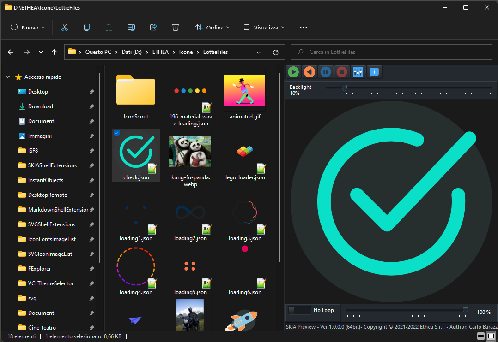

# SKIA Shell Extensions and Lottie Editor 

**Latest Version 1.5.4 - 12 May 2024**

**A collection of extensions tools for image and animations files, integrated into Microsoft Windows Explorer (7, 8, 10 and 11):**

- A [Preview handler][1]  which allows you to see static images and animations files in the "Preview Panel".
 
- A [Thumbnail handler][2] which allows you to see static images and anomations files (the last last frame of animation) into Windows Explorer.

- A [Lottie Text Editor][12] to manually edit and preview the animation of Lottie files.

### Animation and file extensions supported:

**.json** or **.lottie**: animated Lottie files [lottiefiles.com](https://lottiefiles.com/)

**.gif**: static and animated Gif [W3C GIF (tm)](https://www.w3.org/Graphics/GIF/spec-gif87.txt)

**.webp**: static and animated webp [An image format for the Web](https://developers.google.com/speed/webp)

**.tgs**: animated telegram stickers [core.telegram.org/stickers](https://core.telegram.org/stickers)

### Features

- Supports Windows Vista, 7, 8, 10 and 11 (for 32 bits and 64 bits).

- Themes (Dark and Light) according to user preferences of Windows Theme

- Play normal, inverse or manual control

- AutoPlay and Loop of animation when selected into Explorer

### Setup using the Installer

Click to download the [SKIAShellExtensionsSetup.exe][3] located also in the Release area. The Installer works both for 32 and 64 bit system.

***For a clean Setup close all the windows explorer instances which have the preview handler active or the preview handler was used (remember the dll remains in memory until the windows explorer was closed).***

### Preview Panel and Thumbnails in action ###

In Windows 11 with Light theme:

In Windows 11 with Dark theme:

### Lottie Text Editor

A useful Text editor with preview and animation of Lottie files:

### Settings: Preview page

### Settings: Theme page

### Manual Build and Installation (for Delphi developers) ###

If you have Delphi 11 or Delphi 12, you can manually build the project:

***Warning: To build the DLL you need also other open-source projects***

- [SVGIconImageList][4]

- [Synedit][5]

- [VCL-Style-Utils][6]

- [Skia4Delphi][13]

To manually install the SKIAShellExtensions.dll follow these steps:

1. Close all the windows explorer instances which have the preview handler active or the preview handler was used (remember the dll remains in memory until the windows explorer was closed).
  
2. If you have already used the installer uninstall the components from system.
     
3. To Uninstall/Install manually the dll run the `Unregister_Register.cmd` (run-as-administrator).

4. If you want to continue to change code and rebuild the dll, Unregister the dlls and beware to close all Explorer instances.

## Release Notes ##

12 May 2024: ver. 1.5.4
- Added StyledComponents (Rounded Buttons options)
- Added init for GDI+Plus to Dll's
- Deleted unused images

09 May 2024: ver. 1.5.3
- Added File Changed notification and reload
- Built with Delphi 12.1
- Built with Latest Image32 Library
- Built with Latest Skia4Delphi 6.1 Library

13 Jan 2024: ver. 1.5.2
- Aligned to Image32 Library
- Updated Copyright

26 Oct 2023: ver. 1.5.1
- Optimized rendering of Icon using the Skia Codec directly
- Enabled system draw for title and border of Editor when Styled

25 Oct 2023: ver. 1.5.0
- Added "close button" over Tabs in Editor
- Updated to Skia4Delphi 6.0.0-beta 5
- Fixed enabling of Inverse Play Button
- Built with Delphi 12

12 Mar 2023: ver. 1.4.0
- Added "inverse" animation to Preview and Editor

27 Feb 2023: ver. 1.3.0
- Updated to Skia4Delphi 4.1.1
- Updated Projects to Delphi 11.3

13 Jan 2023: ver. 1.2.0
- Updated to Skia4Delphi 4.0.2
- Fixed Animation Panel of Preview

09 Nov 2022: ver. 1.1.0
- Updated to Skia4Delphi 4.0.1
- Fixed settings filename

24 Set 2022: ver. 1.0.1
- Fixed Setup registering 32bit dll
- Fixed settings filename

23 Set 2022: ver. 1.0.0
- First version

## Credits

Many thanks to **Rodrigo Ruz V.** (author of [theroadtodelphi.com][7] Blog) for his wonderful work on [delphi-preview-handler][8] from which this project has used a lot of code and inspiration.

## Powered by Skia4Delphi

Many thanks to the project "Skia4Delphi"

**[Skia4Delphi](https://skia4delphi.org)** is a cross-platform 2D graphics API for Delphi based on [Google's Skia](https://skia.org/) graphics library.

## License

Licensed under the [Apache License, Version 2.0][9] (the "License");
Unless required by applicable law or agreed to in writing, software distributed under the License is distributed on an "AS IS" BASIS, WITHOUT WARRANTIES OR CONDITIONS OF ANY KIND, either express or implied. See the License for the specific language governing permissions and limitations under the License.

The Initial Developer of the [Original Code][8] is **Rodrigo Ruz V**. Portions created by him are Copyright © 2011-2021 Rodrigo Ruz V.

Third Party libraries and tools used from Ethea:

- [SVGIconImageList][4]

Third Party libraries and tools used:

- [VCLStyles Utils][6]

- [SynEdit][5]

- [Skia4Delphi][13]

Related links: [embarcadero.com][10] - [learndelphi.org][11]

[1]: https://docs.microsoft.com/en-us/windows/win32/shell/preview-handlers

[2]: https://docs.microsoft.com/en-us/windows/win32/shell/thumbnail-providers

[3]: https://github.com/EtheaDev/SKIAShellExtensions/releases/latest/download/SKIAShellExtensionsSetup.exe

[4]: https://github.com/EtheaDev/SVGIconImageList

[5]: https://github.com/SynEdit/SynEdit

[6]: https://github.com/RRUZ/vcl-styles-utils

[7]: https://theroadtodelphi.com

[8]: https://github.com/RRUZ/delphi-preview-handler

[9]: https://opensource.org/licenses/Apache-2.0

[10]: https://www.embarcadero.com

[11]: https://learndelphi.org

[12]: https://github.com/EtheaDev/SKIAShellExtensions/wiki/Using-The-Lottie-Text-Editor

[13]: https://skia4delphi.org
